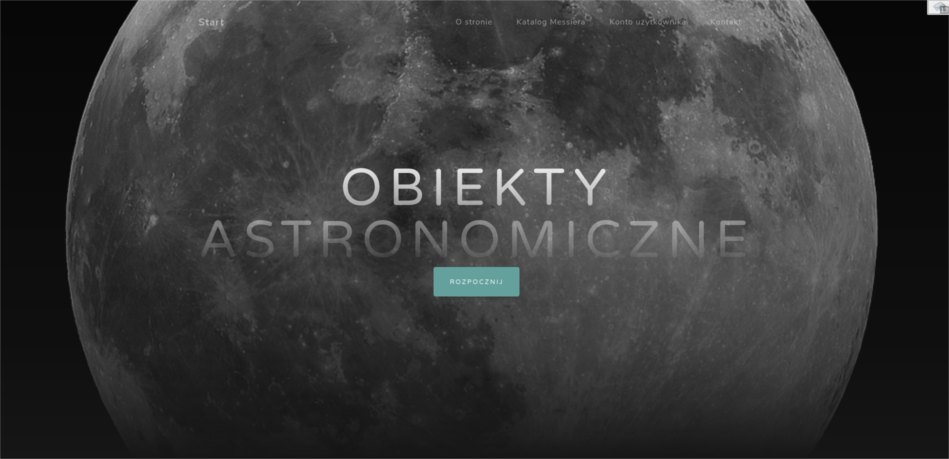

# Astronomical-Objects
> Project of website with Spring technology.

## Table of contents
* [General info](#general-info)
* [Screenshots](#screenshots)
* [Technologies](#technologies)
* [Utilities](#utilities)
* [Setup](#setup)
* [Features](#features)
* [Status](#status)
* [Inspiration](#inspiration)
* [Contact](#contact)

## General info
The project was created for learning Spring technology.
On created page there are a list and photos of many astronomical objects available for observation for every astronomy enthusiast (read from a CSV file).
In addition, the option of creating an account and adding your own sky observation photos has been added. There are two types of user accounts in the project: for ordinary users and for administrators.
The project has an API created using Spring Data Rest.
Website content and information were created from wikipedia.org sources.

## Screenshots

## Technologies
* Spring Framework
* Spring Boot - version 2.1.6.RELEASE
* Spring Data - version 2.2.2.RELEASE
* MySQL
* Spring Validator (with Bean Validation) - version 2.1.6.RELEASE
* Spring Security - version 2.1.6.RELEASE
* REST
* Spring Data Rest - version 3.1.9.RELEASE
* Thymeleaf - version 2.1.6.RELEASE
* Spring Boot Test (with JUnit nad Mockito) - version 2.1.6.RELEASE

## Utilities
* IntelliJ IDEA Ultimate
* Maven
* Docker
* DataGrip
* Postman

## Setup
Added soon

## Features
List of features ready and TODOs for future development
* Loading astronomical catalog from CSV file
* Account creation by the user
* Adding own astronomical objects by users

To-do list:
* Loading all objects added on page by users
* Viewing all users in the database by the administrator
* Deleting user accounts by the administrator

## Status
Project is: _in progress_.

## Inspiration
This project was created for learning Java and Spring technologies. The subject was chosen due to the author's interests :) Materials from wikipedia.org were used.

## Contact
- Created by [Łukasz Bezłada](https://www.linkedin.com/in/lukaszbezlada/)
- Email [Łukasz Bezłada](mailto:lukaszbezlada@interia.pl) - feel free to contact me!
