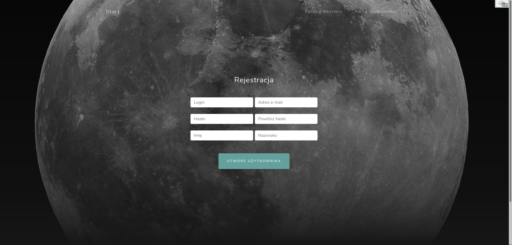
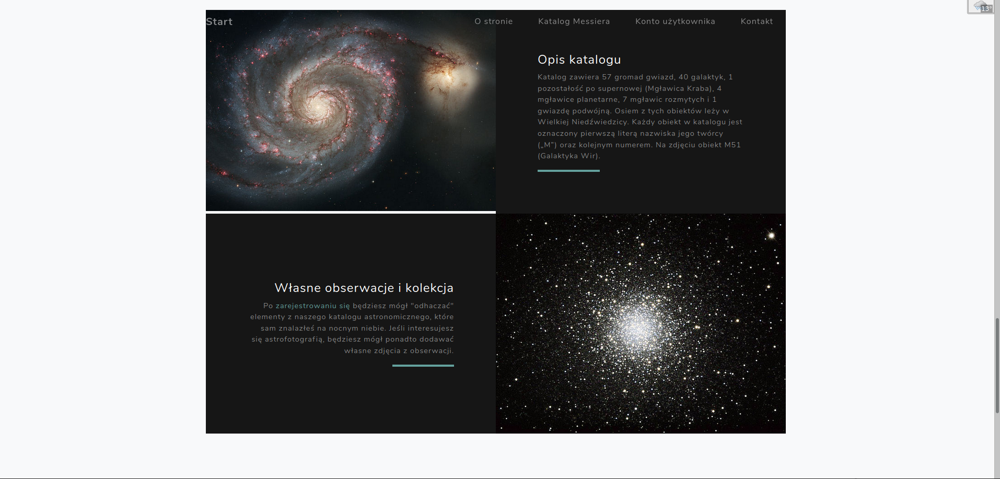
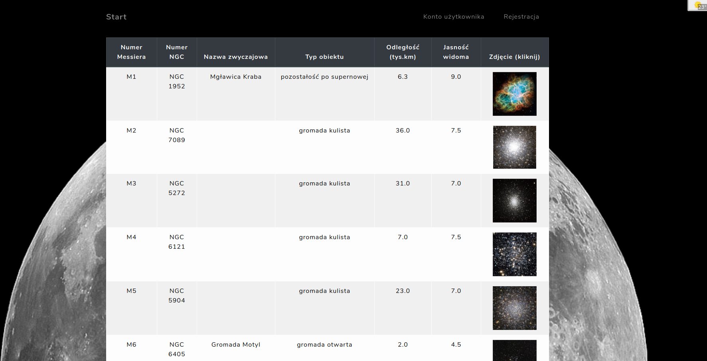
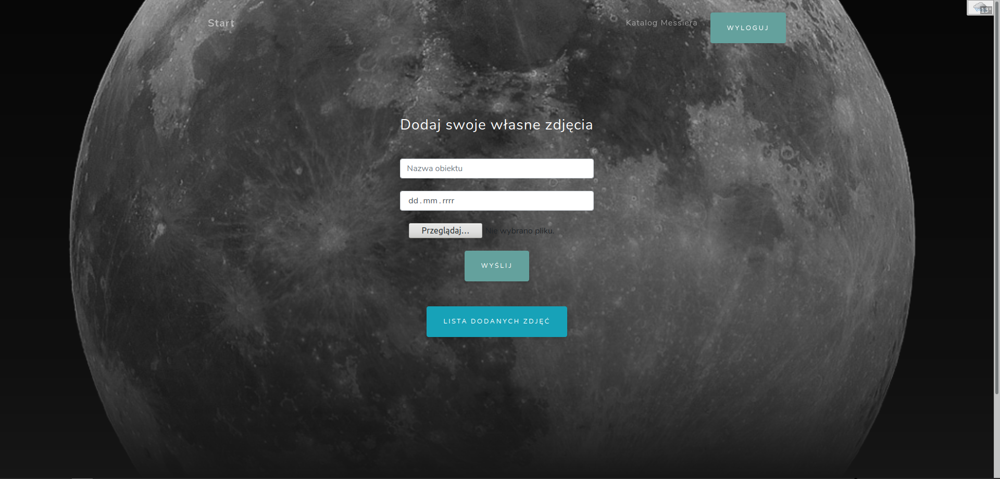
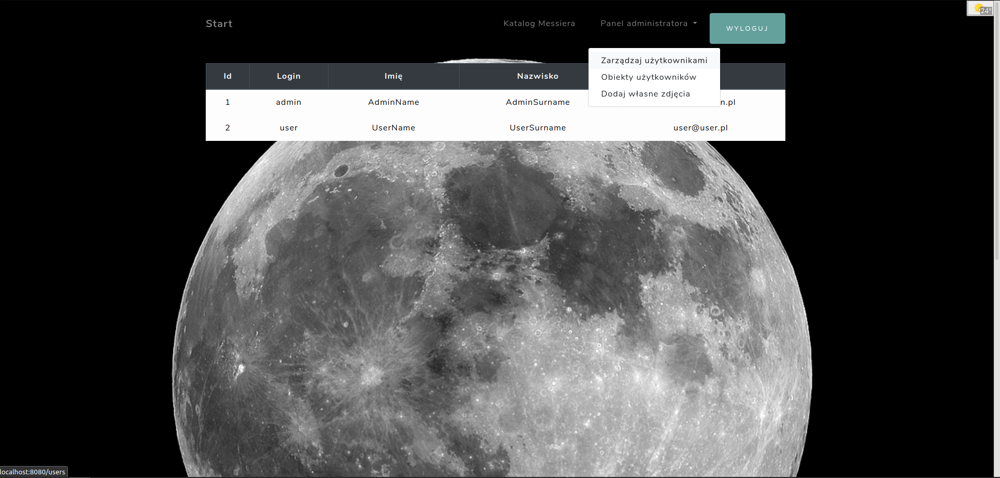

# Astronomical-Objects
> Project of website with Spring technology about astronomy.

## Table of contents
* [General info](#general-info)
* [Screenshots](#screenshots)
* [Technologies](#technologies)
* [Utilities](#utilities)
* [Setup](#setup)
* [Features](#features)
* [Status](#status)
* [Inspiration](#inspiration)
* [Contact](#contact)

## General info
The project was created for learning Spring technology.
On created page there are a list and photos of many astronomical objects available for observation for every astronomy enthusiast (read from a CSV file).
In addition, the option of creating an account and adding your own sky observation photos has been added. There are two types of user accounts in the project: for ordinary users and for administrators.
The project has an API created using Spring Data Rest.
Website content and information were created from wikipedia.org sources.

## Screenshots

## Technologies
* Spring Framework
* Spring Boot - version 2.1.6.RELEASE
* Spring Data JPA - version 2.2.2.RELEASE
* MySQL (Docker container)
* Spring Validator (with Bean Validation) - version 2.1.6.RELEASE
* Spring Security - version 2.1.6.RELEASE
* REST
* Spring Data Rest - version 3.1.9.RELEASE
* Thymeleaf - version 2.1.6.RELEASE
* Spring Boot Test (with JUnit, Mockito and AsserJ libraries) - version 2.1.6.RELEASE

## Utilities
* IntelliJ IDEA Ultimate
* Maven
* Lombok
* Docker
* DataGrip
* Postman

## Setup
Step 1. Run database e.g. with Docker:
 - download mysql image
 - build container: sudo docker run -d --name **CONTAINER_NAME** -e MYSQL_ROOT_PASSWORD=**YOUR_PASSWORD** -v /**LOCALIZATION**:/var/lib/mysql -p 3306:3306 mysql
 - start cointainer: sudo docker run **CONTAINER_NAME**

Step 2. Create database schema from file ao_db.sql (/src/main/resources/ao_db.sql)

Step 3. Download project and run it in IDE or deploy astronomical-objects-0.0.1-SNAPSHOT.war on server

Step 4. Website will be by default at http://localhost:8080/ and API http://localhost:8080/api

## Features
List of features ready and TODOs for future development
* Loading astronomical catalog from CSV file
* Account creation by the user
* Adding and browsing own astronomical objects by users
* Display of all user objects by the administrator
* Preview on the site of all users in the database by the administrator
* Editing user accounts by the administrator

## Status
Project is: _finished_.

## Inspiration
This project was created for learning Java and Spring technologies. The subject was chosen due to the author's interests :) Materials from wikipedia.org were used.

## Contact
- Created by [Łukasz Bezłada](https://www.linkedin.com/in/lukaszbezlada/)
- Email [Łukasz Bezłada](mailto:lukaszbezlada@interia.pl) - feel free to contact me!
